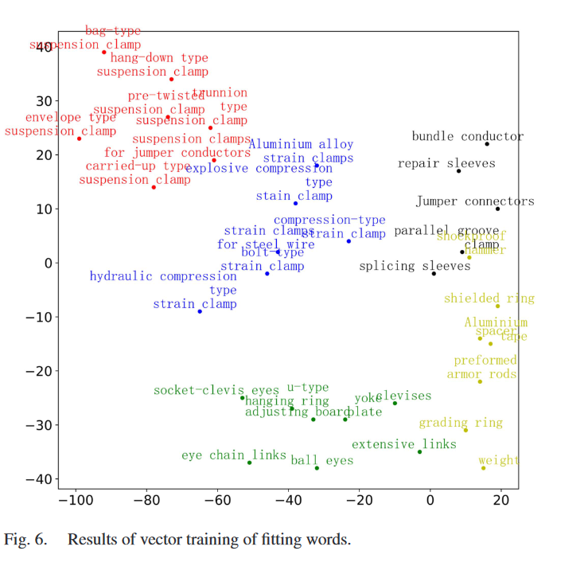

### 总结在目标检测领域如何使用Graph reasoning 进行图的构建

### 2024年

### 2023年

# *[Relational Prior Knowledge Graphs for Detection and Instance Segmentation](https://openaccess.thecvf.com/content/ICCV2023W/SG2RL/html/Ulger_Relational_Prior_Knowledge_Graphs_for_Detection_and_Instance_Segmentation_ICCVW_2023_paper.html)* （ICCV2023）

## 0.Overview

### 1. 知识先验的构建

1. **Co-occurrence**：统计数据集中两种物体同时出现的频率，并将其作为先验，作为概率信息使用。
2. **Relative Orientation**：统计数据集中每对类别之间的相对朝向信息（基于中心点），文中构建了 5 种朝向信息【中心，左，右，上，下】并进行多分类。
3. **Relative Distance**：计算共现的两个物体之间的平均距离（欧式距离）。

构建好的先验图为：  
$R = \langle D, K \rangle$，其中 $K \in \mathbb{R}^{C \times C \times R}$，$R$ 取决于使用的先验知识。

---

## 2. 构建场景图并融合先验知识

首先，在每幅图像中构建一个场景图 $S$，其中节点代表潜在目标（proposal），边表示目标之间的关系：

$$
S = \langle P, E \rangle,  \\
\{p_1, ..., p_N\} = P \in \mathbb{R}^{N \times F_p}, \\
\{e_{ii}, e_{ij}, ..., e_{NN}\} = E \in \mathbb{R}^{N \times N \times F_e}
$$

- **节点集 $P$** 表示场景图中的提案特征，每个节点 $p_i$ 是目标提案的特征，维度为 $F_p$。
- **边集 $E$** 表示节点之间的关系，$e_{ij}$ 是节点 $p_i$ 和 $p_j$ 之间的边缘特征，维度为 $F_e$。

---

### 2.1 使用先验图 $R$ 预测边信息 $E$

为了进一步完善场景图中的边信息 $E$，我们引入先验图 $R$，该图包含了基于先验知识的目标共现关系。通过利用先验图 $R$ 中的节点对 $\{d_u, d_v\}$ 和场景图中的提案节点对 $\{p_i, p_j\}$，我们可以使用注意力机制来预测场景图中的边缘信息。

#### 具体步骤如下：

1. **构建局部特征表示**：

   - 对于场景图中的每个节点对 $[p_i, p_j]$，将它们的特征拼接起来，得到局部特征表示 $\hat{p}_{ij} \in \mathbb{R}^{F_p + F_p}$。
   - 对于先验图中的每个节点对 $[d_u, d_v]$，同样将它们的特征拼接起来，得到局部特征表示 $\hat{d}_{uv} \in \mathbb{R}^{F_r + F_r}$。

2. **计算注意力系数 $\alpha_{(ij),(uv)}$**：

   - 使用共享的线性变换矩阵 $W_q$ 和 $W_k$ 将节点特征映射到潜在空间中，计算场景图中提案节点对和先验图中节点对之间的相似性：
     $$
     \alpha_{(ij),(uv)} = \frac{\exp (\text{att}(W_q [p_i, p_j], W_k [d_u, d_v]))}{\sum_{u=0}^{C} \sum_{v=0}^{C} \exp (\text{att}(W_q [p_i, p_j], W_k [d_u, d_v]))}
     $$

   - 注意力机制通过度量节点对之间的相似性，生成归一化的权重 $\alpha_{(ij),(uv)}$，以表示节点对之间的相关性。

3. **预测边缘信息 $E$**：

   - 使用注意力系数对先验图中的边缘信息进行加权聚合，从而为场景图中的每个节点对生成对应的边缘权重：
     $$
     e_{(ij),(kl)} = \alpha_{(ij),(kl)} W_v R_{kl}
     $$

   - 最终场景图中的边信息 $E_{ij}$ 通过加权聚合所有先验边缘信息得到：
     $$
     E_{ij} = W_E \sum_{k=0}^{C} \sum_{l=0}^{C} e_{(ij),(kl)}
     $$

4. **融合关系信息**：

   - 通过注意力机制和先验图 $R$，我们为场景图 $S$ 中的每个提案对生成基于先验知识的边缘信息 $E$，这些边缘信息表示了场景中提案目标之间的关系。

通过这种方式，我们使用先验知识增强了场景图中的边信息，使得每个提案能够与其他提案之间的关系得以更好地捕捉。这一过程不依赖于提案的具体分类，而是通过注意力机制从先验图中获取相关的关系信息，并将其融入到场景图的边缘中。

---

### 2.2 使用 Proposal 之间的关系（上一步预测的边） 更新节点（proposal）

---

### 节点的更新过程总结

在构建图并融合先验知识后，节点更新过程的主要目的是通过多层图转换器（Graph Transformer）获取每个节点的上下文信息。以下是该过程的关键步骤：

1. **输入信息**：

   - 每个节点的初始特征表示为 $P = \{p_1, p_2, ..., p_N\}$，初始时这些节点之间的关系由边特征矩阵 $E$ 存储。
   - 场景图 $S = \langle P, E \rangle$ 中的每个节点将在多层图转换器的层中逐步更新其特征，以包含来自邻居节点的上下文信息。

2. **消息传递机制**：

   - 在每一层图转换器中，边特征 $E$（或邻接矩阵 $A$）用于在节点之间传递消息。每个节点通过与其邻居节点的交互，获取有关整个图结构的上下文信息。

3. **边特征更新**：

   - 边特征 $f_{ij}^{(l)}$ 表示节点 $i$ 和节点 $j$ 之间的关系。在图转换器的第 0 层时，$f_{ij}^{(l)} = E_{ij}$；在后续层中，$f_{ij}^{(l)} = A_{ij}^{(l-1)}$，使用更新后的邻接矩阵来捕捉节点之间的关系。

4. **节点特征更新**：

   - 每个节点 $p_i$ 的特征 $n_i^{(l)}$ 在第 0 层时，直接等于节点的初始特征 $p_i$。在更高层时，使用上一层更新后的节点特征 $z_i^{(l-1)}$ 进行更新。

5. **注意力机制**：

   - 节点之间的消息传递通过注意力机制进行。注意力权重 $\alpha_{ij}^{(l)}$ 是根据边特征和节点特征的相似性计算得出的，表示节点 $j$ 对节点 $i$ 的影响力。

   - 注意力权重的计算公式为：
     $$
     \alpha_{ij}^{(l)} = \sigma(\text{LReLU}([f_{ij}^{(l)} \oplus n_i^{(l)}]))
     $$
     其中，$\oplus$ 表示特征拼接，LReLU 表示 Leaky ReLU 激活函数，$\sigma$ 是 Softmax 函数，用于归一化注意力权重。

6. **消息聚合**：

   - 节点 $i$ 的消息 $m_i^{(l)}$ 是其邻居节点的加权和：
     $$
     m_i^{(l)} = \sum_{j \in I} \alpha_{ij}^{(l)} f_{ij}^{(l)}
     $$

   - 其中 $I$ 是节点 $i$ 的邻居节点集合，$\alpha_{ij}^{(l)}$ 是节点 $j$ 对节点 $i$ 的影响权重。

7. **上下文更新后的节点特征**：

   - 每个节点的特征在聚合消息后进行更新，结合原始特征和聚合的消息，经过 LayerNorm 进行标准化：
     $$
     \hat{z}_i^{(l)} = \text{LN}(n_i^{(l)} + m_i^{(l), head} + m_i^{(l), tail})
     $$

   - 然后通过线性变换得到最终的节点特征更新：
     $$
     z_i^{(l)} = \text{LN}(\hat{z}_i^{(l)} + f(\hat{z}_i^{(l)}))
     $$

   - 其中，$f(\cdot)$ 是一个包含两个线性层的函数，每层后面有一个 Leaky ReLU 激活。

8. **节点特征输出**：

   - 最终，每个节点通过多层图转换器的处理，融合了来自其邻居的上下文信息，形成上下文感知的节点特征。这些更新后的节点特征可以进一步用于场景理解或目标检测等任务中。

### 2022年

# [Multi-fitting detection on transmission line based on cascade reasoning   graph network](https://ieeexplore.ieee.org/abstract/document/9739825/)

## 共现知识构建与推理模块总结

### 1. 共现知识的构建

- **共现知识**通过数据集中的类别共现频率作为外部知识进行构建，并使用条件概率来计算对象之间的共现概率。公式如下：
  $$
  P(f_A|f_B) = \frac{P(f_A, f_B)}{P(f_B)} = \frac{N(f_A, f_B) / N_{\text{all}}}{N_{f_B} / N_{\text{all}}} = \frac{N(f_A, f_B)}{N_{f_B}}
  $$
  - $N(f_A, f_B)$：两个对象同时出现的频率。
  - $N_{f_B}$：对象 $f_B$ 出现的总次数。
  - $N_{\text{all}}$：所有图像的数量。
  
- 通过计算共现概率矩阵，能够有效地表达不同类别的对象之间的共现关系。这些共现知识可以帮助深度学习模型更好地进行推理。

### 2. 共现推理模块

- **共现推理模块**利用构建好的共现知识矩阵，并通过自适应拓扑图的生成来增强特征表达。
1. **真实关系图的生成**：
   
- 共现知识矩阵 $s_r \in \mathbb{R}^{N_r \times C}$ 映射了类别与区域提案之间的关系，生成了真实关系图 $\epsilon_T \in \mathbb{R}^{N_r \times N_r}$。$N_r$ 为区域提案的数量，$C$ 为类别数量。
  
2. **视觉特征到节点特征的转换**：
   
- 从骨干网络中提取高维视觉特征 $f = \{f_i\}_{i=1}^{N_r}$，每个特征 $f_i \in \mathbb{R}^{D_b}$，通过线性变换转换为节点特征 $z = \{z_i\}_{i=1}^{N_r}, z_i \in \mathbb{R}^{D_z}$，其中 $D_z$ 是节点特征的维度。
3. **自适应关系图的计算**：
   
   - 使用 **L1 范数**和 **多层感知机（MLP）** 计算节点之间的自适应共现关系，生成自适应关系图 $\epsilon_A \in \mathbb{R}^{N_r \times N_r}$：
     $$
     \hat{e}_{ij} = \text{MLP}(\alpha(z_i, z_j))
     $$
    其中，$\hat{e}_{ij}$ 是自适应关系图中的边权重，$\alpha(z_i, z_j)$ 是通过 L1 范数计算的节点间相似性。
   
4. **损失函数的优化**：
   
   - 使用均方误差（MSE）损失函数，将自适应关系图中的边权重与真实关系图中的边权重进行对比，从而学习外部共现知识：
     $$
     L = \sum_{i=1}^{N_r} \sum_{j=1}^{N_r} (\hat{e}_{ij} - \tilde{e}_{ij})^2
     $$
    其中，$\tilde{e}_{ij}$ 是真实关系图中的边权重。
   
5. **视觉特征融合**：
   
   - 将自适应关系图 $\epsilon_A$ 与区域提案的视觉特征加权融合，并通过多层感知机（MLP）将特征转换为增强的特征层 $f' \in \mathbb{R}^E$：
     $$
     f' = \hat{\epsilon} f W_e
     $$
    其中，$W_e \in \mathbb{R}^{D_z \times E}$ 是 MLP 的参数，用于将节点特征维度转换为增强特征的维度 $E$。
   
6. **级联操作**：
   
   - 最终，增强后的视觉特征层 $f'$ 与原始特征层进行级联，结合外部共现知识后的特征可以更好地用于检测任务，从而提高模型的性能。

### 3.语义知识推理模块

#### 1**语义知识构建**：

- 首先，收集大量包含类别标签的文本数据，这些数据可以来自技术手册、论文等。通过使用 **word2vec** 等工具对这些文本进行向量化，将每个类别的文本描述转化为一个词向量。   - **余弦相似度计算**：通过计算词向量之间的余弦相似度，衡量不同类别之间的语义距离。

  公式如下：  

    $$s_{i,j} =\frac{\exp(\cos(w_i, w_j))}{\sum_j \exp(\cos(w_i, w_j))}$$

其中，$w_i$ 和 $w_j$ 分别代表类别 $i$ 和 $j$ 的词向量，$\cos(w_i, w_j)$ 表示两者之间的相似度。

- 利用这些相似度，构建类别之间的语义关系，并将其应用于后续的推理过程中。

2.**基于语义知识的推理**：

- **类别特征表示的学习**：首先，通过网络学习得到每个类别的隐式特征表示。这些特征向量代表了每个类别的外观或语义特性，称为类别外观特征。这些特征通过网络训练阶段自动生成，并结合了类别的视觉和语义信息。
- **类别概率分布的生成**：网络根据输入的图像输出每个类别的概率分布 $M \in \mathbb{R}^{N_r \times C}$，其中 $N_r$ 是区域提案的数量，$C$ 是类别的总数。这个概率分布表示每个区域提案属于每个类别的可能性。 
- **生成图节点特征**：将分类器生成的概率分布 $M$ 与预先训练好的类别外观特征矩阵 $T \in \mathbb{R}^{C \times D_t}$ 进行矩阵乘法，生成每个区域提案的高维特征表示 $X \in \mathbb{R}^{N_r \times D_t}$：   $  X = M \times T $

然后使用图卷积网络对图进行更新，有点类似ICCV上面的做法

### 4.空间知识推理

### 2021年

### 2020 年

### 2019年

### [Reasoning-rcnn: Unifying adaptive global reasoning into large-scale object detection](http://openaccess.thecvf.com/content_CVPR_2019/html/Xu_Reasoning-RCNN_Unifying_Adaptive_Global_Reasoning_Into_Large-Scale_Object_Detection_CVPR_2019_paper.html)

[code](https://github.com/chanyn/Reasoning-RCNN)

